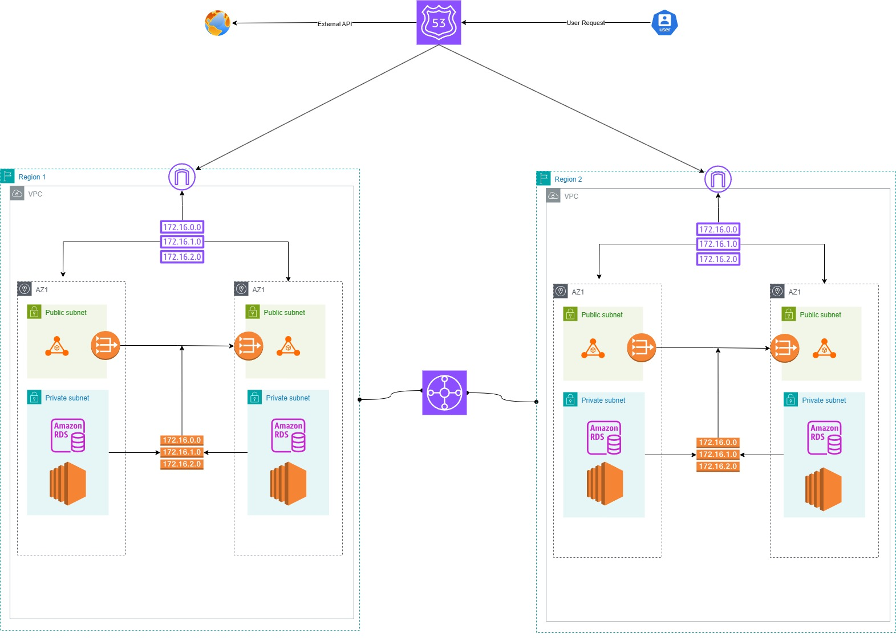

# Networking Assignment - 02

## Diagram

## Assumptions

- Using single shared private network across both AZs
- Public network has ALB for load balancing traffic
- Private network with Amazon RDS for DB and EC2 instances for hosting app

## Project Details
This is a network design for a Real Estate Finder Company. Here users can search listing and place communicate with the other party. The project proposes a AWS Network Design for the company.

## Architecture Decisions
I have used route 53 for routing traffic to two different regions & VPCs. Each region has two different AGz. There is a public subnet for each AG but both ag is sharing a private subnet. Each public subnet has a ALB and a NAT gateway. Both regions are connected via AWS Transit Gateway.

## Reasoning
Multi Region & VPC:  Two regions ensure fault tolerance and high availability.
Multi AGz: Two AZs per region ensure fault tolerance.
ALB: For load balancing traffic to ec2 instances.
NAT Gateway: Allows private instances to call external (third‑party API) services while restricting direct access.
AWS Transit Gateway: For communicating between VPCs.
Amazon RDS: Using amazon RDS for easily manage and scale databases.
EC2: Using this to host the application backend itself.

## Networking Components Used And Their Use Case:
VPC, subnets: Isolate and route traffic securely across AZs
Transit Gateway: Connect VPCs within/between regions (prod/dev/data sync)
NAT Gateway: Outbound traffic to third‑party APIs from private subnets
Internet Gateway &  ALB : User traffic ingress, SSL termination, load balancing.

## Cost Estimates
| Scale          | Concurrent Users | Monthly Active Users | EC2 Cluster Type | RDS Type           | Total EC2 Cost | Total RDS Cost | Other Infra (NAT, ALB, etc.) | **Estimated Total** |
| -------------- | ---------------- | -------------------- | ---------------- | ------------------ | -------------- | -------------- | ---------------------------- | ------------------- |
| **Small**      | 100              | 100,000              | t3.medium × 4    | db.t3.medium × 2   | \~\$200        | \~\$200        | \~\$300                      | **\~\$700**         |
| **Medium**     | 10,000           | 1,000,000            | m5.large × 10    | db.r6g.large × 2   | \~\$1,000      | \~\$750        | \~\$750                      | **\~\$2,500**       |
| **Large**      | 100,000          | 10,000,000           | m5.2xlarge × 25  | db.r6g.2xlarge × 3 | \~\$6,000      | \~\$2,200      | \~\$1,200                    | **\~\$9,500**       |
| **Enterprise** | 500,000+         | 100,000,000          | m5.4xlarge × 60+ | Aurora Global × 4+ | \~\$20,000     | \~\$8,000      | \~\$3,000                    | **\~\$31,000+**     |
